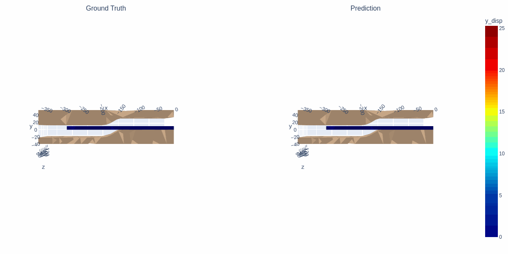
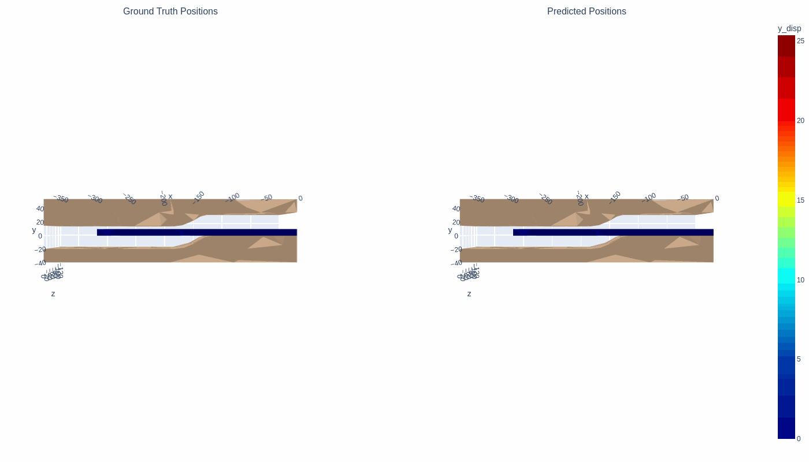

# PressNet: Mesh-Based Simulation with Graph Neural Networks


> **🚀 Project Status:** Successful inference on the PressNet dataset. The model has established a new baseline for the **400-step coarse** variant of the dataset.

## 📌 Overview
This repository contains a **MeshGraphNet** implementation (based on the DeepMind architecture) tailored for simulating **non-linear structural deformation** on the **PressNet** dataset.

The goal is to accelerate Finite Element Method (FEM) solvers by using Graph Neural Networks (GNNs) to predict the interaction between the kinematic "Tool" and the dynamic "Metal" meshes.

---

## 📊 Experimental Results

### 1. Current Best: Generalized Model (Test Set)
*Phase: Generalization*

Unlike the initial proof-of-concept, this model successfully generalizes across **29 unseen trajectories** in the test set. It establishes a strong baseline for the **400-step coarse simulation task**.

* **Average RMSE:** `1.88 mm`
* **Average Max RMSE:** `2.92 mm`
* **Stability:** Stable rollouts achieved for the full **400 time steps**.

| Trajectory 0 (Step 222k) | Trajectory 18 (Step 222k) |
| :---: | :---: |
|  |  |

<br>

### 2. Early Development: Proof of Concept (Group 0)
*Phase: Architecture Validation*

Before scaling to the full dataset, the architecture was validated on a single data group (`group_0`) to ensure it could capture the non-linear physics of the die stamping process. These results demonstrate the model's ability to learn the specific deformation mechanics of a single shape.

| Proof of Concept (Single Group Overfit) |
| :---: |
|  |

---

## 🚀 Key Features
* **Encoder-Processor-Decoder Architecture:** Implements the core GNN structure to pass messages between mesh nodes.
* **Hybrid Velocity Handling:** Differentiates between:
    * **Tool Nodes:** Driven by kinematic target positions.
    * **Metal Nodes:** Driven by physical forces/previous velocity.
* **Nonlinearity Capture:** Validated capability to learn complex, non-linear mesh deformations.
* **History Windowing:** Utilizes `t-1`, `t`, and `t+1` states to capture temporal dynamics.
* **Custom Early Stopping:** Implements a "Best Model" saver to ensure the optimal weights are preserved during training.

## 🛠️ Installation

1.  **Clone the repository:**
    ```bash
    git clone [https://github.com/your-username/pressnet-meshgraphnets.git](https://github.com/your-username/pressnet-meshgraphnets.git)
    cd pressnet-meshgraphnets
    ```

2.  **Install dependencies:**
    ```bash
    pip install -r requirements.txt
    ```

3.  **Dataset Setup:**
    * Place `meta.json`, `train.tfrecord`, and `valid.tfrecord` files in your dataset directory (e.g., `./data/`).
    * **Dataset Variant:** This model was trained on the `15x10_400steps_coarse_data` variant.

## 💻 Usage

### Training
To train the model on the dataset:

```bash
python pressnet_run_model.py \
  --mode=train \
  --model=pressnet \
  --dataset_dir=./data \
  --checkpoint_dir=./checkpoints \
  --batch_size=2
Evaluation
To run a rollout and generate a trajectory file from the saved best_model:

Bash
python pressnet_run_model.py \
  --mode=eval \
  --model=pressnet \
  --dataset_dir=./data \
  --checkpoint_dir=./checkpoints \
  --rollout_path=output/rollout.pkl
📉 Development Roadmap
Current Status:

[x] Core Architecture: Implemented Encoder, Processor (Message Passing), and Decoder.

[x] Data Loading: Efficient TFRecord parsing with history buffering.

[x] Proof of Concept: Verified non-linear capture on single-group data (Group 0).

[x] Validation: Validated generalization on full 400-step coarse dataset with <2mm average error.

Future Work:

[ ] High Fidelity: Scaling training to the 1500-step fine-mesh dataset.

[ ] Curvature Optimization: Further reducing error in high-curvature regions of the die.

[ ] Generalization: Testing on unseen die geometries not present in the training set.

📚 Acknowledgements & References
This project is built upon foundational research in graph-based physical simulations.

Original Paper: "Learning Mesh-Based Simulation with Graph Networks" by Pfaff et al. (ICML 2021).

DeepMind Implementation: Heavily inspired by the official DeepMind research repository.

* **PressNet Dataset:** [Dataset Specifications](https://github.com/AnK-Accelerated-Komputing/PressNet/tree/01d727a1e1c604c8f82058b4392b7f1eb3c08717/datasets#details-of-pressnet-dataset).
